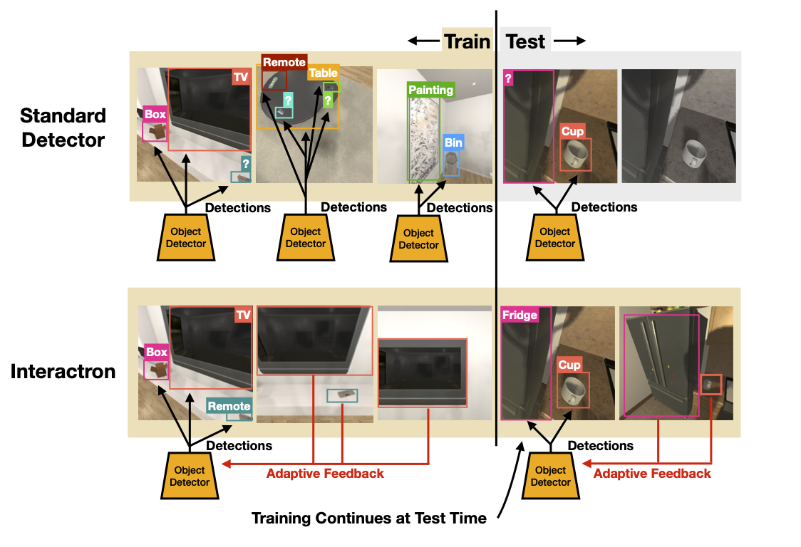

# Interactron: Embodied Adaptive Object Detection

By Klemen Kotar and Roozbeh Mottagh



Interactron is a model for interactive, embodied object detection.
It is the official codebase for the paper 
[Interactron: Embodied Adaptive Object Detection](https://arxiv.org/abs/2202.00660).
Traditionally object detectors are trained on a fixed training set and frozen at evaluation.
This project explores methods of dynamically adpating object detection models to their test
time environments using MAML style meta learning and interactive exploration.


## Setup

- Clone the repository with `git clone https://github.com/allenai/interactron.git && cd interactron`.

- Install the necessary packages. If you are using pip then simply run `pip install -r requirements.txt`.

- If running on GPUs, we strongly recommend installing PyTorch with conda.

- Download the [pretrained weights](https://interactron.s3.us-east-2.amazonaws.com/pretrained_weights.tar.gz) and
[data](https://interactron.s3.us-east-2.amazonaws.com/data.tar.gz) to the `interactron` directory. Untar with
```bash
tar -xzf pretrained_weights.tar.gz
tar -xzf data.tar.gz
```

## Results

Bellow is a summary of the results of the various models.

| Model            | Policy   | Adaptive | AP    | AP_50 |
|------------------|----------|----------|-------|-------|
| DETR             | No Move  | No       | 0.256 | 0.448 | 
| Multi-Frame      | Random   | No       | 0.288 | 0.517 | 
| Interactron-Rand | Random   | Yes      | 0.313 | 0.551 | 
| Interactron      | Learned  | Yes      | 0.328 | 0.575 | 

For more detaile results please see the full paper 
[Interactron: Embodied Adaptive Object Detection](https://arxiv.org/abs/2202.00660).

## Evaluation

Evaluation of the Interactron model can be performed by running ``python evaluate.py --config=configs/interactron.yaml``.
The code will automatically take over any available GPUs. Running the evaluation on a CPU could 
take several minutes. The evaluator will output visualizations and results in a folder called
`evaluation_results/`. To evaluate other models, select one of the other config files in `configs/`.


## Training

Training of the Interactron model can be performed by running ``python train.py --config=configs/interactron.yaml``.
The code will automatically take over any available GPUs. To train using the default configuration, 
at least 24GB of VRAM is necessary. Training takes roughly one day on a high performance machine using a RTX 3090 GPU.
The trainer will output results in a folder called
`training_results/`. To train other models, select one of the other config files in `configs/`.


## Citation
```
@inproceedings{kotar2022interactron,
  title={Interactron: Embodied Adaptive Object Detection},
  author={Klemen Kotar and Roozbeh Mottaghi},
  booktitle={CVPR},  
  year={2022},
}
```

Parts of the codebase were derived from other repositories and modified (like the DETR model code) 
and have a crediting comment on the first line of the file.
